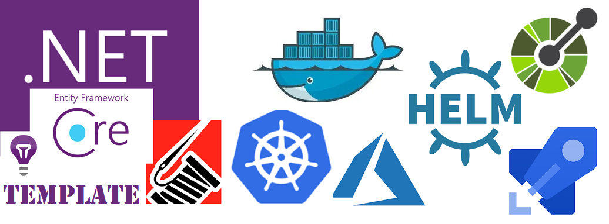
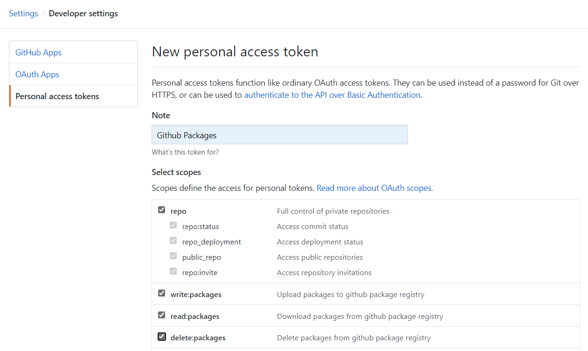

# Dot Net Api Rest Basic Template
Is a AspNet Core (API Rest) template to provide Best Practices and use several professional componentes and much more. Also everything you have to know how about it and how DotNet Templates work.



|Code Quaity|Buid & deploy status for develop|Buid & deploy status for master|
|:--:|:--:|:--:|
|[](https://sonarcloud.io/dashboard?id=DotNet.ApiRest.BasicTemplate)|[](https://dev.azure.com/JuanluElGuerre/elGuerre/_build/latest?definitionId=24&branchName=develop)|[](https://dev.azure.com/JuanluElGuerre/elGuerre/_build/latest?definitionId=24&branchName=master)|
||||

**API project structure**:
- Application
    - Models. Models, ViewModels and DTOs used by Controllers and Services.
    - Services. Application Logic.
- Controllers (Think controllers)
- Domain
    - Exceptions.
    - Interfaces.
- Infrastructure
    - ActionResults
    - EntityConfigurations. EF programatically configuration.
    - Filters. ASPNet Core Filteres.
    - Http. Client to invoque other API Rests.
    - Middlewares.
    - Providers.
    - Repositories. DB repositories to use EF easyly in an isolatted layer.

**k8s folder**
Kubernetes and helm ".YAML" configuration to publish API to Kubernetes.

**azure folder**
Azure resources scripts to register App in Azure Active Directory (AAD).
other scripts, like ARM (Azure Resource Manager), could be added here.

## What is going to Learn?
1. DotNet Templates
2. API REST using NetCore and best practices:
    - [Swagger](https://docs.microsoft.com/es-es/aspnet/core/tutorials/getting-started-with-swashbuckle?view=aspnetcore-2.2&tabs=visual-studio)
    - [Serilog](https://serilog.net/) and also 'ApplicationInsight' + Serilog Extensions.
    - Entity Framework Core for Commands.
    - [Automapper](https://automapper.org/). Optional to map Model/entities.
    - Entity Framework.
    - HelthChecks.
    - Authentication using Azure Active Directory(AAD App Registration).
3. Docker
4. Kubernetes and Helm
5. Azure Pipelines
6. SonarQube / Sonar Cloud.io
7. Api Management & Authenticacion AAD [Future Version]
8. Azure DevSpaces [Future Version]
9. And much more.

# Blog
All those new Patterns, Tools and Platforms, will be Blog Post entries in [elGuerre.com](https://elguerre.com)


# Runnng the App
1. Using Kestrel from Visual Studio:
`
xxx
`
2. Using Docker from Visual Studio or Docker Command Line:
`
xxx
`
3. Run Entity Framework Migration: 
```
cd ElGuerre.Items.Api
dotnet ef migrations add Init --startup-project ..\src\ElGuerre.Items.Api.csproj
dotnet ef database update --startup-project ..\src\ElGuerre.Items.Api.csproj
``` 

# Generate and publish Template

## Package a new template version
- `Nuget.exe pack ElGuerre.ApiRest.Template.nuspec -Version 1.0.n`

## Nuget.org
`dotnet nuget push AppLogger.1.0.0.nupkg -k xxx -s https://api.nuget.org/v3/index.json`


## Github (Packages)

### Update Nuget.config
- Update ```%APPDATA%\NuGet\NuGet.config``` and delete properties "github".
- Set or updated Nuget.config properties with the password already got in the previous steps
- `nuget.exe sources Add -Name github -Source https://nuget.pkg.github.com/juanluelguerre/index.json -username ### USERNAME ### -password ### TOKEN ###`

**Note** TOKEN will be generated as follow. More details [here](https://help.github.com/en/github/managing-packages-with-github-packages/about-github-packages#about-tokens).



### PUblish a new template version
```
dotnet nuget push "ElGuerre.ApiRest.Template.1.0.0.nupkg" --source "github"
```
### Publish a new template version
- `dotnet nuget push --source github ElGuerre.ApiRest.Template.1.0.n.nupkg`
or
- `nuget.exe push -Source github ElGuerre.ApiRest.Template.1.0.n.nupkg`

## Azure DevOps (Artifacts)

### Generate a new token
- %USERPROFILE%\.nuget\plugins\netfx\CredentialProvider.Microsoft\CredentialProvider.Microsoft.exe -U https://pkgs.dev.azure.com/JuanluElGuerre/elGuerre/_packaging/templates/nuget/v3/index.json

### Update Nuget.config
- Update ```%APPDATA%\NuGet\NuGet.config``` and delete properties "templates".
- Set or updated Nuget.config properties with the password already got in the previous steps
- `nuget.exe sources Add -Name templates -Source https://pkgs.dev.azure.com/JuanluElGuerre/elGuerre/_packaging/Templates/nuget/v3/index.json -username unused -password ### TOKEN ###`

### Publish a new template version
- nuget.exe push -source templates -ApiKey AzureDevOps ElGuerre.ApiRest.Template.1.0.n.nupkg

## Install and uninstall templates

Clear cache: ```dotnet nuget locals http-cache --clear```
Add new templates ```dotnet new -i ElGuerre.ApiRest.Template::*```

**Note:** List of templeates cached: ```dotnet nuget locals all --list```
**Note:** Remove cached of templatess Http and Temps: ```dotnet nuget locals http-cache --clear``` y ```dotnet nuget locals temp --clear```
